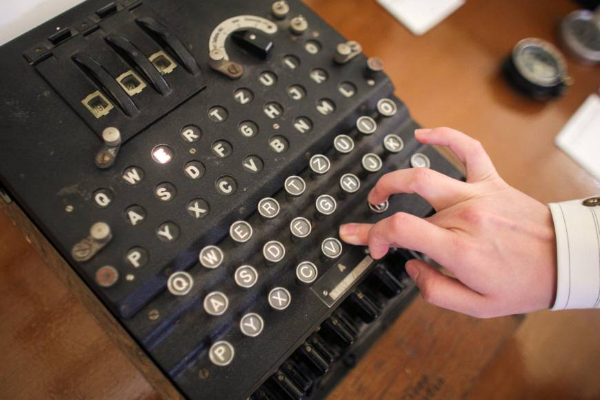
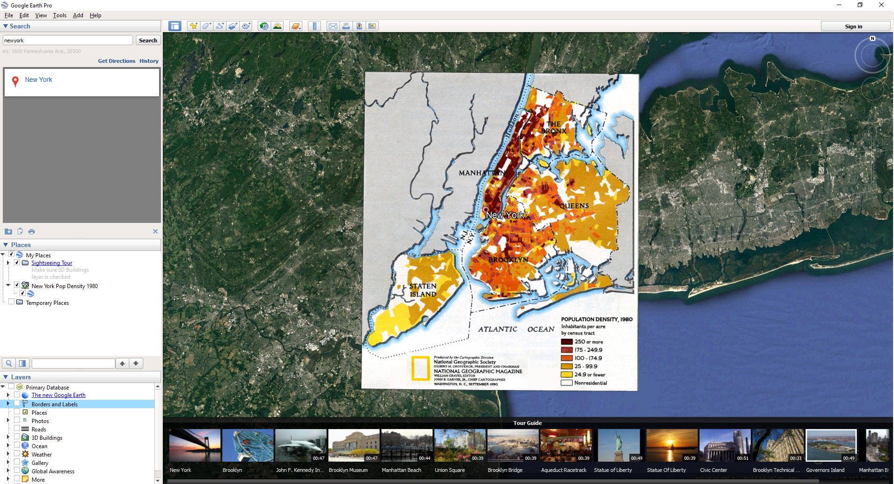

# IASC2P02

## Bio 

 Hello! My name is Anna Lang. 

  I am currently in my second year of Interactive Arts and Sciences at Brock University. I am in my third year here at Brock but in my first year was enrolled in the Business Communication. I am expected to Graduate as of 2020. The reason for this switch was that I wanted a more creative program. 

  My specific research interest is cultural studies. The research program that I would like to undertake is how the current technology is changing the educational system in a secondary schools and post secondary education. 

  My existing projects reflect my specialization in cultural studies through looking at how collaboration between students have changed. My portfolio demonstrates these expertise by showing a wide variety of interest is several sections back up by references. 

  I have an interest in further work specialized in the ties to cultural, technology and the youth. I believe that this work can happen within the upper years of my degree thought the courses that are required for my program as well as any electives that I choose to take. 
 

  

## Featured Project:  Research presentation  

  

 

This solo presentation that I completed. This specific project was to complete a Pecha Kucha presentation, which is a presentation that uses automatically advanced presentation slides. This presentation is suppose to be 5 minute review of 20 slides that are shown for 20 seconds each. This idea is that each slide being shown has a specific focus and there is no wasted time. The topic that I choose to focus on was the Enigma Machine used within the second world war and how this changed the War. I approached this project with the thought that every second within the presentation counted and that each slide needed to have a specific focus and was required for the presentation to be successful. My approach to this project was to research and find as much information as I possibly could and then only use the information to make my point. 

Here is my 250 word statement describing how this reasearch evolved over time. I made these changes, which you acan see here [here] link to git hub commit. 

I also makde these changes which you can see [here] link to other change compit 

Overall these changes show x and y changes to my thinking. 

+ When looking at the digital humanities we are required to acknowledge the difference between data and capta. The way information is displayed allows the viewer to make preconceived assumptions therefore within the digital humanities the graphs need to display information in a slightly...[Continue reading](publishblogpost.md)

## Collaborative Project 

  Within this collaborative project my group of four worked to explain, create and show a group of students what the tool Hypercities could do. This task required our group to communicate heavily with each other and to work side by side to make a unified assignment. We relied on the the site Github to communicate and post parts of the project. We also communicated in the form of a group chat on the social media platform Facebook. We found that not only that Hypercities was a more difficult concept to grasp but the tool its self was extreme hard to use. 

I personally approach collaboration in a way that focuses on communication, which is reflected in this work by how our project was connected through out the presentation. By focusing on communication this allows all members of the group to be aware of what direction this project is taking, it also enables the group members to allocate their time while knowing what still needs to be completed. I sent up the some pages available for collaboration on the groups assigned Github page. We also used a google doc to complete our slide show. This allowed the members to work in real time all at once. I also approach collaboration in the direct way, which is related to all group members being responsible for their assigned work. I also contributed some leadership assets to my team, seen below through the completion of the setting up of the github. By helping establish what roles everyone had we were able to work individually and on our own time.  

  

  

## Research presentation 

[Click Here](reveal/index.html)

## Academic Blog

When looking at the digital humanities we are required to acknowledge the difference between data and capta. The way information is displayed allows the viewer to make preconceived assumptions therefore within the digital humanities the graphs need to display information in a slightly...[Continue reading](publishblogpost.md)
