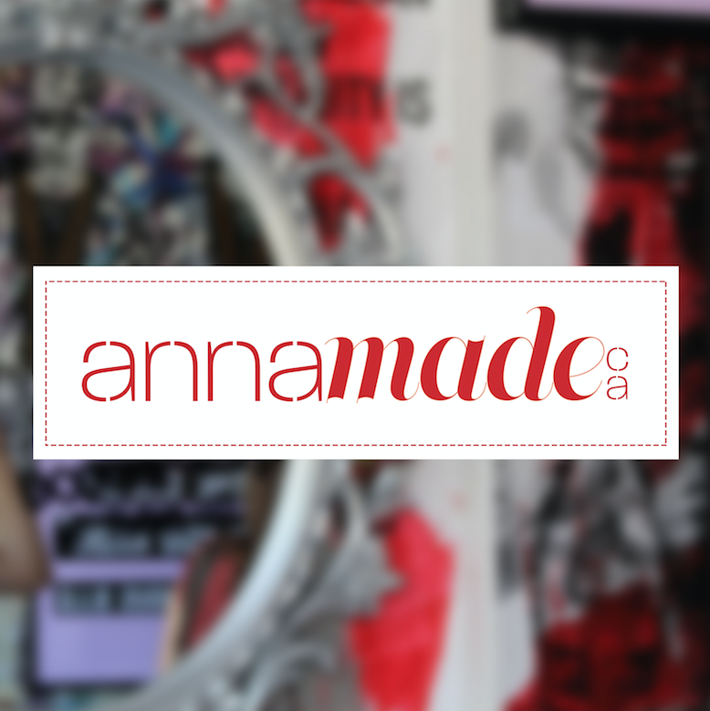

# IASC2P02

 Hello! My name is Anna Lang. I am currently in my second year of Interactive Arts and Sciences at Brock University. I am in my third year here at Brock but took a year of Business Communication. I wanted a more creative program so switched at the beginning of my second year. 
 

 I also run my own business designing and printing apparel from my home. This is something that I very much enjoy and would like to continue after I finish school. I have inserted a picture of my Logo 

+ When looking at the digital humanities we are required to acknowledge the difference between data and capta. The way information is displayed allows the viewer to make preconceived assumptions therefore within the digital humanities the graphs need to display information in a slightly...<a href="publishblogpost.md">continue reading</a>

[Contribution guidelines for this project](publishblogpost.md)
