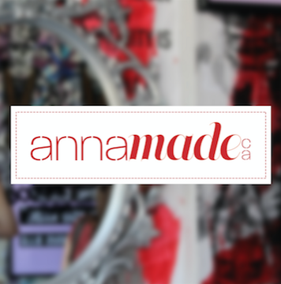

# IASC2P02

## Bio 

 Hello! My name is Anna Lang. I am currently in my second year of Interactive Arts and Sciences at Brock University. I am in my third year here at Brock but took a year of Business Communication. I wanted a more creative program so switched at the beginning of my second year. 
 

 I also run my own business designing and printing apparel from my home. This is something that I very much enjoy and would like to continue after I finish school. I have inserted a picture of my Logo 

## Featured Project: [Title of project]

image 

Here is 250 workds introducing this work. 
Here is my 250 word statement describing how this reasearch evolved over time. I made these changes, which you acan see here [here] link to git hub commit. 

I also makde these changes which you can see [here] link to other change compit 

Overall these changes show x and y changes to my thinking. 

Read [title goes here](readme)

## Collaborative Project 

100 word project description. 

here is my 250 word collaboration statement. I apptoach collabration in x ways, which is reflectied in y work. (avaible here link to comit.) I also approach collabortion in a ways, which is relected in b work (avaiblle here link.) I also contributed x assets to my team, seen below. 

Image

1 comit 
1 image 

## Academic blog 

## Reaseach presentation
[Link to Solo Presentation](reveal/index.html)

+ When looking at the digital humanities we are required to acknowledge the difference between data and capta. The way information is displayed allows the viewer to make preconceived assumptions therefore within the digital humanities the graphs need to display information in a slightly...[Continue reading](publishblogpost.md)

Solo Presentation 

