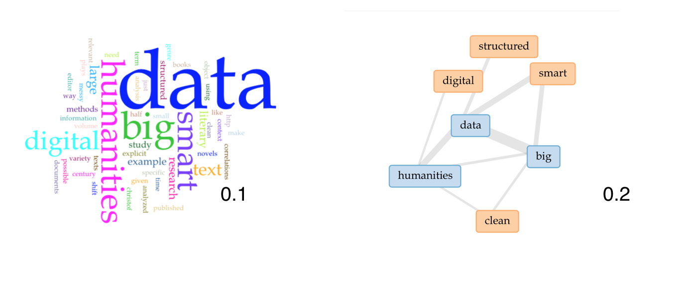

When looking at the digital humanities we are required to acknowledge the difference between data and capta. The way information is displayed allows the viewer to make preconceived assumptions therefore within the digital humanities the graphs need to display information in a slightly different way to reduce the assumptions made about the information. When using data the humanistic has to acknowledge that the information given and situational, partial, and that the information is recognize that not simply given as a pre-existing fact. 
	With visualization becoming an increasingly important piece of the digital humanities as it is an easier way to illustrate large amounts of data that give viewers the ability to comprehend information in a shorter amount of time. We are required to look at how those visualizations and comprehensions are made through the assumptions you receive it in the visualizations.
	Since the majority of these visualizations that the members of the digital humanities community use are taken from science they are being produced with the assumption that the data that is being represented with in them is correct and accurate. We need to make the distinction between data and capta the further our understanding of these visualizations. 
	Data is something that comes from Latin to mean given. But as Drucker argues data is something that you are able to record and observe. The data is able to be recorded and observed. The idea behind capta is It better represents the statement knowledge production as it is situational, partial, and consecutive. Is within humanistic methods of knowledge there tends to be more than one moving parts therefore one simplistic graph will not fully share all the required information.
	Furthermore the use of traditional graphs are not always the best way to display data from the digital humanities fields and by altering them we are able to present the wider variety of information. While creating graphs that are untraditional it can cause some difficulty when reading them but are a better way to express capta. There is the complication of the users ability to read the graph and by creating new graphs the communication of this graph is less effective.
	While having graphs that are ineffective it is almost as important to reflection on the data being used in these graphs. Within the following quote from Christof Schöch article Big? Smart? Clean? Messy? Data in the Humanities we are able to see that the bias of the data can also alter the information being given.
	“underlining the idea that even the very act of capturing data in the first place is oriented by certain goals, done with specific instruments, and driven by a specific attention to a small part of what could have been captured given different goals and instruments. In otherwords, capturing data is not passively accepting what is given, but actively constructing what one is interested in." (Schoch, 2013) 
	To further my understanding of this concept I tried to create a graph out of this article to show that the main focus was the combination of data with the humanities. When I inputted the article into the Volant visualization tool I was given a variety of different graphs.  by doing what I can see how authors could choose one graph over the other to help assist in improving the point. By doing so they are not technically manipulating the data just only showing a specific viewpoint of that data, essentially the data is being misrepresented.
	
	Above are two different graphs and it is easy to see how you could misrepresent data if you chose one over the other.  For example if you are trying to show how much these articles used the word “data” choosing graph 0.1 would be beneficial as the word data is large and bold. where in graphs 0.2 data is just centred and shown to have a stronger affinity is being used with the other words. Therefore by using graphs 0.1 the data is being represented in a way that is benefiting the author.
	Within Bethany Nowviskie article neatline & visualization as interpretation it can be seen that she has created a digital storytelling tool. This function of this is to be able to map information that is not stable and express information that is subjective.
	“Its timelines and drawing tools are respectful of ambiguity, uncertainty, and subjectivity, and allow for multiple aesthetics to emerge and be expressed. The platform itself is architected so as to allow multiple, complementary or even wholly conflicting interpretations to be layered over the same, core set of humanities data. This data is understood to be unstable (in the best sense of the term) – extensible, never fixed or complete – and able to be enriched, enhanced, and altered by the activity of the scholar or curator” (Nowviskie, 2014)    
	These types of visualizations should be used more in the digital humanities to allow a Transparency with the reader therefore allowing a clearer understanding of where the information as well as how subjective that information. By expressing this open and allows the reader to interpret the data instead of having the data interpreted for them.     
	

Work Cited 

Drucker, Johanna. “Humanities Approaches to Graphical Display.” Digital Humanities, 1 May 2011, www.digitalhumanities.org/dhq/vol/5/1/000091/000091.html. 

Nowviskie, Bethany. “Neatline & Visualization as Interpretation.” Nowviskie.org, 2 Nov. 2014, nowviskie.org/2014/neatline-and-visualization-as-interpretation/.

Schoch, Christof. “Big? Smart? Clean? Messy? Data in the Humanities.” Journal Of Digital Humanities, 18 Dec. 2013, hal.archives-ouvertes.fr/hal-00920254/document.

Visualization created through https://voyant-tools.org

